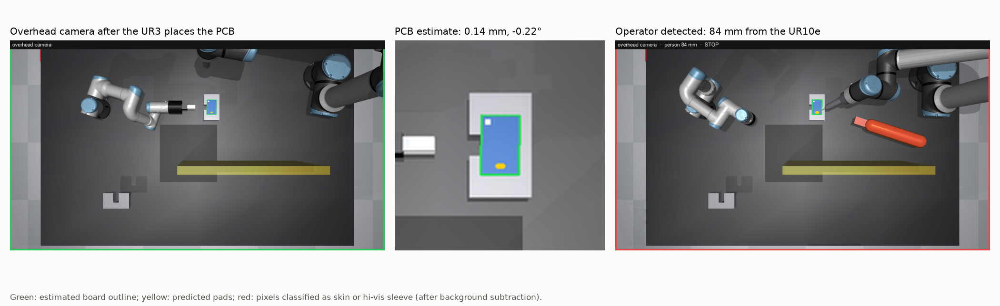
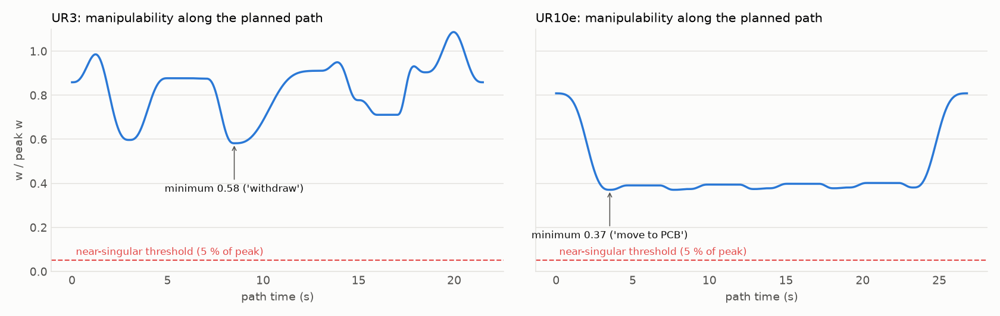
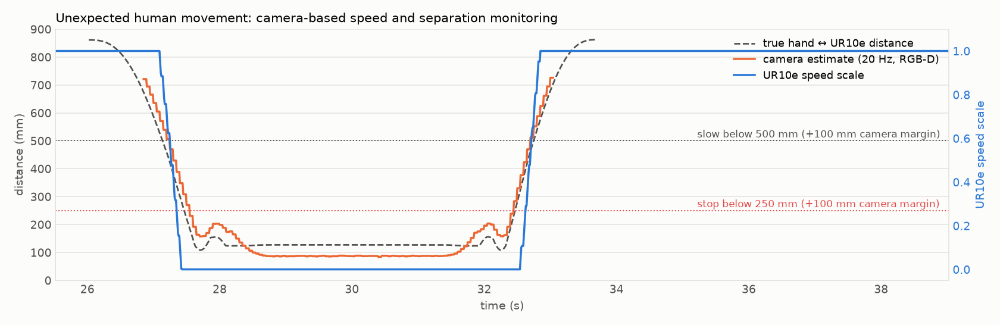

# Robotic Soldering Cell (UR3 + UR10e) — MATLAB + MuJoCo

MSc Robotics coursework (Cranfield University, *Robotics Control*): a UR3 with a
Robotiq Hand-E gripper moves a PCB from Position 3 to Position 4, then a UR10e with
a soldering tool solders four points on it. The original MATLAB work covers the
kinematics, trajectories and an idealised controller (Parts A–C); the **MuJoCo
simulation** rebuilds the cell with the **real UR3 and UR10e models** and full
rigid-body dynamics to test Part C properly.


**Results (MuJoCo, regenerated by `mujoco_sim/results_table.py`)**

- **Computed-torque control** with retuned gains tracks the planned paths to
  0.08 mm (UR3) and 0.22 mm (UR10e) mean tool error and solders all four pads within
  0.22 mm — even when the controller's dynamics model is 15 % too heavy.
- The coursework PID+FF law **cannot hold the real arms up** without a dynamics
  model (UR10e mean error 0.96 m); with the coursework gains inside computed torque,
  no pad is hit within 1 mm.
- **An overhead RGB-D camera closes the loop**: the UR10e solders from the PCB pose
  the camera measures (0.14 mm / 0.22° error), and the same camera detects the
  operator for safety monitoring — no simulator ground truth is used.
- **Induced errors are handled**: a 30 N / 100 N knock on each tool is rejected within
  0.7 s (back under 0.5 mm), and an operator's hand reaching round the shield **stops
  the UR10e for 5.1 s** — it never moves while the hand is truly within 250 mm —
  before it resumes and finishes.
- **Singularities are avoided by design**: IK is locked to one solution branch, so
  manipulability never drops below 58 % (UR3) / 37 % (UR10e) of peak.
- **Workspace analysis drives the grasp**: with the gripper pointing down the UR3
  reaches only ~517 mm at PCB height, but Pos3 and Pos4 are 561 mm and 685 mm away —
  so the UR3 must grip the PCB's edge horizontally (reach ~726 mm).

---

## Repo structure

```
.
├── main_partC.m, cfg_partC.m, ...   MATLAB coursework (see "MATLAB coursework" below)
├── mujoco_sim/
│   ├── robots/ur10e/            UR10e from MuJoCo Menagerie (BSD-3)
│   ├── robots/ur3/              UR3 built from Universal Robots' description (BSD-3)
│   ├── make_ur3.py              converts UR's UR3 meshes + kinematics into MuJoCo
│   ├── build_scene.py           the cell from the brief: bench, holders, shield, camera,
│   │                            PCB, Hand-E gripper, solder tool, operator's hand
│   ├── planner.py               IK (branch-locked), path segments, singularity checks
│   ├── vision.py                overhead RGB-D camera: calibration, PCB pose, person detection
│   ├── simulate.py              dynamics, controllers, induced errors, task checks
│   ├── results_table.py         scenario matrix → results table
│   ├── make_figures.py          every figure and the GIF in figures/
│   └── cell_model.py            Python port of the MATLAB model (for the Jacobian analysis)
└── figures/
```

## How to run

**MuJoCo** (Python 3.10+):
```bash
cd mujoco_sim
pip install -r requirements.txt
python simulate.py --view                     # watch the full cycle (tuned gains, both errors)
python simulate.py --gains matlab             # coursework gains
python simulate.py --controller pid           # coursework law without a dynamics model
python simulate.py --model-error 0.15         # controller's model 15 % too heavy
python simulate.py --no-push --no-human       # nominal cycle
python simulate.py --speed 2 --view           # everything twice as fast
python simulate.py --no-vision                # ground truth instead of the camera
python vision.py                              # camera calibration + Part A.5 transforms
python results_table.py                       # results table
python make_figures.py                        # all figures + GIF
```

**MATLAB** (no toolboxes needed): `cd` into the repo and run `main_partC`.

---

## The cell (brief, Figure 2)


| Item | Value used |
|---|---|
| Origin | top-left corner of the bench; X along the 125 cm side, Y along the 194.5 cm side, Z up |
| UR3 base / UR10e base | (X, Y) = (400, 370) mm / (200, 1725) mm |
| PCB at Pos3 / Pos4 | (945, 505) mm / (405, 1055) mm, 140 mm above the bench |
| PCB / holders | 85 × 55 × 1.6 mm / 150 × 90 mm |
| Shield | 700 × 40 × 500 mm at X = 720–760 mm, Y = 880–1580 mm |
| Camera | RGB-D, 1950 mm above the bench centre looking down; 1920 × 1080, 38° vertical FOV (1.12 mm/px at the PCB) |
| UR3 tool | Robotiq Hand-E, 152 mm (Figure 5); TCP 151 mm from the flange |
| UR10e tool | solder tool, 280 mm (Figure 4), tilted 30° from vertical |

**Robot models.** The UR10e is the official [MuJoCo Menagerie](https://github.com/google-deepmind/mujoco_menagerie)
model. Menagerie has no UR3, so `make_ur3.py` builds one from
[Universal Robots' description](https://github.com/UniversalRobots/Universal_Robots_ROS2_Description):
joint origins from `default_kinematics.yaml`, meshes from the `.dae` files with UR's
mesh offsets. Its flange pose matches UR's published DH parameters to 0.000 mm over
200 random configurations. The brief's Figure 3 dimensions are exactly these
published values. All position servos are replaced by joint-torque motors.

---

## Part C in simulation

### Path planning

**UR3 — pick and place (21.5 s).** Gripper horizontal, pointing away from the base:
move in front of Pos3 → slide in → close on the PCB edge → lift 30 mm → withdraw →
carry → slide over Pos4 → lower → open → withdraw → home. Each holder has a 30 mm slot
on the UR3's side so the lower finger can pass under the board.

**UR10e — soldering (26.8 s).** Starts once the UR3 has withdrawn from Pos4, as the
brief specifies. It is planned from the **PCB pose measured by the overhead camera**
(see below), so placement error does not become soldering error.
For each of four header pads on the board: approach along the tool axis, dwell 2 s
with the iron hot, retract 50 mm.

Free-space moves are minimum-jerk joint interpolations between IK solutions;
approaches and retreats are straight Cartesian lines with IK at every sample. Speeds
are deliberately moderate (the UR3 carries the board at ≤ 0.29 m/s); `--speed` scales
everything.

### Overhead camera (Parts A.4 / A.5 in practice)

The camera's calibration is the Part A.5 transform. With the image aligned to the
brief's Figure 2 (Y to the right, X down), the camera frame (OpenCV convention:
x right, y down, z forward) relative to the origin is

```
T_origin_camera = [ 0  1  0  0.625  ]      intrinsics: f = 1568.3 px,
                  [ 1  0  0  0.9725 ]      principal point (960, 540)
                  [ 0  0 -1  1.900  ]
                  [ 0  0  0  1      ]
```

(`python vision.py` prints it, its inverse, and the robot bases and holders in the
camera frame.)

**PCB pose.** After the UR3 withdraws, a 1920 × 1080 frame is segmented for the
saturated blue of the board inside a window around Position 4. The pixels are
back-projected onto the PCB's top plane (140 mm + 1.6 mm, known from Part A), and the
board's centre and long axis come from their mean and principal axis. A small white
fiducial on the board resolves its 180° symmetry — without it the pads could be
placed at the wrong end. Result: **0.14 mm position and 0.22° orientation error, or
0.22 mm at the pads**. Two practical lessons: the camera needed its own exposure
(the overhead lights saturate a top-down view), and detection had to use colour
saturation rather than raw RGB, because the robots' light-blue caps look like the
board.

**Operator detection.** At 20 Hz a 960 × 540 RGB-D frame is segmented for skin and the
operator's hi-vis orange sleeve, after **background subtraction** (otherwise static
objects — the red origin marker, the shield over a shadow — were classified as
people). The detected pixels become 3D points through the depth image (3 mm noise),
and their distance to the UR10e is measured against capsules between the robot's own
joint centres. The camera tracks the true distance to −2 mm on average (−43 to +81 mm
when the hand is partly hidden). If the person disappears from view within 400 mm —
e.g. under the robot's arm — the monitor assumes contact and stops the robot.



### Singularities

UR arms have three singularities: elbow (joint 3 = 0 or π), wrist (joint 5 = 0 or π)
and shoulder (wrist centre on the base axis). The first planner picked whichever IK
solution was closest numerically; for the UR3 that was a flipped-wrist solution, and
the move to it swept joint 5 through −180°, dropping manipulability to 0.5 % of peak.
The planner now **locks every IK solution to the home branch** (shoulder in (−π, 0),
elbow in (0, π), wrist 2 in (−π, 0), each with a 12° margin), so joint-space moves
cannot cross the elbow or wrist singularity, and checks the Yoshikawa index
`w = √det(J·Jᵀ)` along every path against 5 % of each arm's peak.



### Control

`controller_pidff.m` integrates `q̈ = u` — a unit-inertia, gravity-free double
integrator per joint. On a real arm that law needs a dynamics model underneath it:

- `pid` — the PID+FF output applied directly as joint torque.
- `ct` — computed torque, `τ = M̂(q)(q̈_ref + Kp·e + Ki·∫e + Kd·ė) + ĥ(q, q̇)`, which
  turns each joint back into the double integrator the MATLAB model assumes.
  `--model-error` scales the controller's link masses and inertias.

With computed torque each joint's error obeys `ë + Kd·ė + Kp·e + Ki·∫e = 0`. For the
coursework gains (Kp = 50, Ki = 5, Kd = 10) the poles are −4.95 ± 4.95j and **−0.10**:
the integral term leaves a ~10 s tail after any disturbance. The tuned gains
(Kp = 400, Ki = 2000, Kd = 40) place them at −28 and −5.8 ± 6.1j.


### Induced errors

- **Unexpected collision:** a 50 ms knock on each tool — 30 N down on the UR3 while it
  carries the PCB, 100 N sideways on the UR10e between pads 2 and 3.
- **Unexpected human movement:** an operator's hand reaches round the end of the
  shield toward the PCB while the UR10e is soldering (it never comes closer than
  28 mm to the shield). **Speed and separation monitoring** on the camera's distance
  scales the UR10e's path speed down below 500 mm and stops it below 250 mm, with a
  0.2 s protective stop; the path clock resumes when the hand withdraws, so the task
  completes without re-planning. As in ISO/TS 15066, the protective distance includes
  the sensor's uncertainty: 100 mm is subtracted from the camera's distance (its
  measured worst over-estimate plus one frame of hand motion). The first version
  without this margin let the robot move inside 250 mm for 0.31 s; with it, 0.00 s.




### Results

Full cycle with both induced errors in every scenario; the overhead camera provides
the PCB pose and the operator distance throughout. "Moving inside 250 mm" uses the
true hand distance — it is the safety check on the camera-based monitor.

| scenario | UR3 mean tool error (mm) | UR10e mean tool error (mm) | PCB placement error (mm) | pads within 1 mm | UR10e stopped / moving inside 250 mm (s) | cycle (s) |
|---|---|---|---|---|---|---|
| Coursework PID+FF law as raw torque | 93.66 | 960.55 | 85.7 | 0/4 (worst 797.77 mm) | 5.1 / 0.00 | 50.7 |
| Computed torque, coursework gains | 1.10 | 3.22 | 1.9 | 0/4 (worst 4.57 mm) | 5.1 / 0.00 | 50.7 |
| Computed torque, tuned gains | 0.08 | 0.22 | 0.0 | 4/4 (worst 0.22 mm) | 5.1 / 0.00 | 50.7 |
| Computed torque, coursework gains, model +15 % | 9.51 | 9.52 | 17.2 | 0/4 (worst 47.52 mm) | 5.1 / 0.00 | 50.7 |
| Computed torque, tuned gains, model +15 % | 0.12 | 0.24 | 0.0 | 4/4 (worst 0.19 mm) | 5.1 / 0.00 | 50.7 |

---

## Findings about the coursework (Part A) model

Building the real-robot simulation exposed several issues in the MATLAB model:

1. **The DH table describes a mirror image of a UR arm.** No joint-sign / offset
   mapping makes a real UR10e reproduce the MATLAB poses; reflecting the MATLAB tool
   positions in a vertical plane matches the real arm to within 1.7 mm (the remainder
   is rounding in the link lengths). The MuJoCo plans therefore solve IK on the real
   robots for the same targets instead of reusing the MATLAB joint angles.
2. **The Jacobian used the standard-DH axis rule with modified-DH frames** (fixed —
   see below).
3. **The solder points were not on the PCB.** The brief asks for points *on* the PCB
   at Position 4; the MATLAB points lie 11–25 mm outside the board's outline (with the
   85 mm side along the 150 mm holder). The simulation solders four header pads on the
   board itself.
4. **Two layout values differ from Figure 2:** the shield is at X ≈ 740 mm (MATLAB:
   945 mm, Position 3's X), and the UR10e base is at Y = 1725 mm (MATLAB: 1695 mm).
5. **The UR3's home pose (all joints 0°) is singular** — fully stretched with the
   wrist aligned. The simulation uses UR's standard elbow-up home.

### Jacobian fix

`jacobian_geometric.m` took joint *i*'s axis from frame *i−1* (the standard-DH rule)
while `fk_dh.m` uses modified DH, where joint *i* rotates about z of frame *i*.
Against a finite-difference Jacobian the linear part was off by up to 757 mm/rad (UR3)
and 1,620 mm/rad (UR10e); after the fix the difference is < 0.001 mm/rad.


The MATLAB figures (`fig1`–`fig5b`) are not committed; run `main_partC` to generate
them with the corrected Jacobian. `rng(0)` now makes the disturbance reproducible.

## MATLAB coursework

- **UR3** Home → Pos3 → Pos4 → Home; **UR10e** Home → P1 → P2 → P3 → P4 → Home.
- `traj_build.m`: minimum-jerk quintic segments per joint with joint-space
  approach/retreat offsets.
- `controller_pidff.m`: discrete PID + acceleration feed-forward with anti-windup, with
  and without a one-shot state disturbance.
- `fk_dh.m`, `jacobian_geometric.m`: modified (Craig) DH, positions stored in
  `[Y, X, Z]` order (the DH frame's local x is workcell X).
- `plot_manipulability_graph.m`: Yoshikawa index along each trajectory.

---

## Limitations

- **Grasp assumptions.** The PCB is carried kinematically (a mocap body) rather than
  held by contact friction, and the holders are modelled with a slot for the lower
  finger — the brief gives only their outline.
- **No physical contact.** Robot links, tools and the hand do not collide; clearances
  and the operator distance are computed geometrically.
- **Menagerie's UR10e flange** sits 100 mm past wrist 3 rather than the 116.55 mm in
  UR's DH table, so the solder tip is 16.5 mm closer to the wrist than on the real
  tool stack.
- **Approximate inertias** for the UR3 links (box approximations using UR's masses).
- **Idealised camera.** The rendered images have no lens distortion, motion blur or
  lighting changes, and the calibration is exact; a real cell would need intrinsic and
  hand-eye calibration. Person detection by colour (skin, hi-vis) is a stand-in for a
  learned detector or a certified safety scanner.
- **Optional filter (bonus in the brief) not implemented** — e.g. a low-pass filter on
  measured joint velocities.

## Author

Biswajeet Panda — MSc Robotics, Cranfield University
