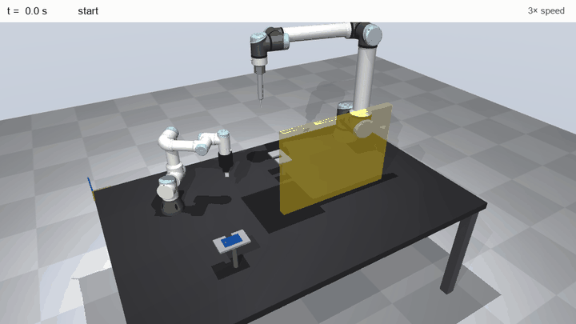
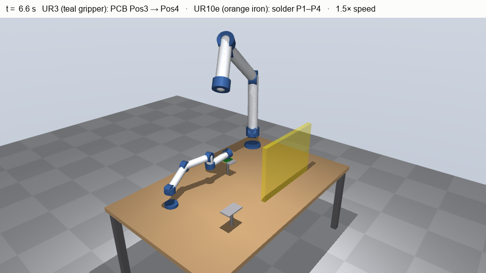
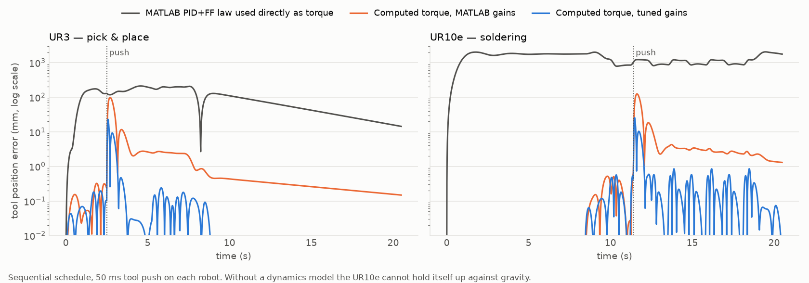
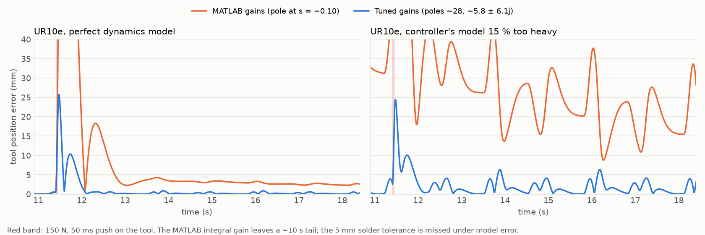
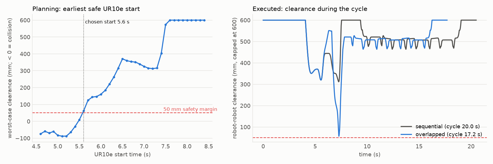
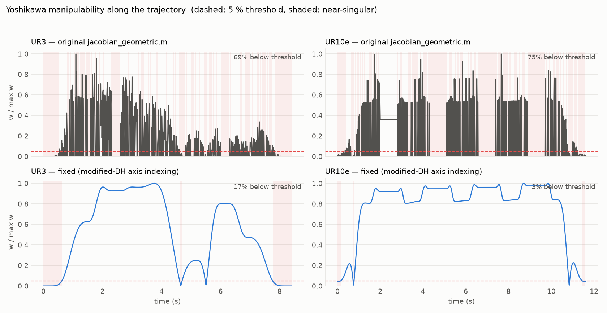

# Dual-Robot Collaborative Workcell (UR3 + UR10e) — MATLAB + MuJoCo

A UR3 moves a PCB from Pos3 to Pos4 and a UR10e solders four points on it, in a
shared workcell. The original MSc Robotics coursework (Cranfield University) models
kinematics, trajectories and an idealised controller in MATLAB; a **MuJoCo
simulation** built from the same DH tables then adds full rigid-body dynamics, a
physical disturbance, PCB transport, solder-point checks and collision-aware
scheduling of the two robots.



**Results (MuJoCo, every number regenerated by `mujoco_sim/results_table.py`)**

- The MATLAB PID+FF law only works on its idealised plant: applied as real joint
  torque, the UR10e collapses under gravity (1.4 m mean tool error). Used as the
  outer loop of a **computed-torque** controller — the controller the MATLAB model
  implicitly assumes — the same law tracks to 2.7 / 3.7 mm.
- The MATLAB integral gain creates a closed-loop pole at s = −0.10 (a 10 s time
  constant). **Retuned gains** cut mean tool error to 0.27 / 0.37 mm and keep every
  solder point within 0.01 mm **even with a 15 % dynamics-model error**, where the
  original gains miss all four.
- Collision-checked scheduling lets the UR10e start 2.8 s early: **cycle time 20.0 →
  17.2 s (−14 %)** with ≥ 50 mm clearance between the arms (56 mm achieved).
- Fixed a DH-convention bug in the geometric Jacobian, which had made the
  singularity analysis report 69–75 % of the motion as near-singular (now 17 % / 3 %,
  and only around the home poses).

---

## Repo structure

```
.
├── main_partC.m                 MATLAB entry point — run this
├── cfg_partC.m                  gains, timestep, thresholds, output paths
├── robots_define.m              UR3 / UR10e DH parameters
├── workcell_define.m            bench, holders, PCB, solder points
├── poses_waypoints.m            named joint-space poses (Home, Pos3/4, P1–P4)
├── traj_build.m                 minimum-jerk quintic trajectory chaining
├── controller_pidff.m           PID + acceleration feed-forward (double-integrator plant)
├── fk_dh.m                      forward kinematics (modified/Craig DH)
├── jacobian_geometric.m         geometric Jacobian
├── draw_workcell.m, animate_cell.m, plot_*.m   MATLAB plots and animation
├── mujoco_sim/
│   ├── cell_model.py            Python port of the MATLAB model (same DH, poses, trajectories)
│   ├── build_scene.py           generates workcell.xml from the DH tables
│   ├── workcell.xml             the MuJoCo scene
│   ├── simulate.py              dynamics, controllers, disturbance, PCB, solder checks, scheduling
│   ├── results_table.py         scenario matrix → results table below
│   └── make_figures.py          every figure and the GIF in figures/
└── figures/                     generated figures
```

## How to run

**MATLAB** (no toolboxes needed): `cd` into the repo and run `main_partC`. It writes
`fig1`–`fig5b` into `figures/`, then waits for a key press before the animation.

**MuJoCo** (Python 3.10+):
```bash
cd mujoco_sim
pip install -r requirements.txt
python simulate.py --view                                   # live viewer, MATLAB gains
python simulate.py --gains tuned --schedule overlap --view  # tuned gains, overlapped cycle
python simulate.py --controller pid                         # MATLAB law as raw torque
python simulate.py --gains tuned --model-error 0.15         # robustness test
python results_table.py                                     # results table
python make_figures.py                                      # all figures + GIF
```

---

## MuJoCo simulation



**Model.** Each arm is built body by body from the MATLAB DH table, so the MuJoCo
kinematics are identical to `fk_dh.m` (tool position agrees to 0.0000 mm at every task
pose). Link masses and joint torque limits are the published UR values; links are
simple capsules (no vendor meshes). `d6` includes the tool (gripper on the UR3,
soldering iron on the UR10e), drawn in the robot's accent colour. Physics runs at
1 kHz.

**Controllers.** `controller_pidff.m` integrates `q̈ = u` — a unit-inertia,
gravity-free double integrator per joint. On a real arm that law needs a dynamics
model underneath it:

- `pid` — the MATLAB law's output applied directly as joint torque.
- `ct` — computed torque, `τ = M̂(q)(q̈_ref + Kp·e + Ki·∫e + Kd·ė) + ĥ(q, q̇)`, which
  turns each joint back into the double integrator the MATLAB model assumes.
  `--model-error` scales the controller's link masses and inertias to test robustness.

**Disturbance.** A 50 ms horizontal push on each tool (40 N on the UR3, 150 N on the
UR10e) at the same times as the MATLAB disturbance (2.5 s and 3.0 s into each robot's
motion).

**Task checks.** The UR3 carries the PCB while its gripper is closed and releases it
on the Pos4 holder; the UR10e's hot tip must come within 5 mm of each solder point.

### Results

All scenarios include the push disturbance; sequential schedule unless stated.

| scenario | UR3 mean tool error (mm) | UR10e mean tool error (mm) | PCB placement error (mm) | solder points within 5 mm | min clearance (mm) | cycle (s) |
|---|---|---|---|---|---|---|
| MATLAB PID+FF law as raw torque | 94.72 | 1388.24 | 69.1 | 0/4 (worst 761.86 mm) | 129 | 20.0 |
| Computed torque, MATLAB gains | 2.67 | 3.73 | 2.6 | 4/4 (worst 2.90 mm) | 312 | 20.0 |
| Computed torque, tuned gains | 0.27 | 0.37 | 0.0 | 4/4 (worst 0.01 mm) | 312 | 20.0 |
| Computed torque, MATLAB gains, model +15 % | 13.88 | 21.39 | 10.3 | 0/4 (worst 31.23 mm) | 318 | 20.0 |
| Computed torque, tuned gains, model +15 % | 0.50 | 1.10 | 0.3 | 4/4 (worst 0.01 mm) | 312 | 20.0 |
| Tuned gains, model +15 %, overlapped schedule | 0.57 | 1.27 | 0.3 | 4/4 (worst 0.01 mm) | 56 | 17.2 |



### Why the MATLAB gains recover slowly

With computed torque each joint's error obeys `ë + Kd·ė + Kp·e + Ki·∫e = 0`. For the
MATLAB gains (Kp = 50, Ki = 5, Kd = 10) the characteristic polynomial
`s³ + 10s² + 50s + 5` has roots at −4.95 ± 4.95j and **−0.10**: the integral term
creates a pole with a ~10 s time constant, so after a push or under model error the
tool stays millimetres off for seconds. The tuned gains (Kp = 400, Ki = 2000,
Kd = 40) place the poles at −28 and −5.8 ± 6.1j, using at most 67 % of the joint
torque limits.



### Coordinating the two robots

Pos4 sits 40–50 mm from the solder points, so the robots cannot simply run at the
same time — starting both at t = 0 makes the UR10e's wrist hit the UR3's gripper.
`plan_overlap()` sweeps the UR10e start time, rejects starts where the iron would
reach P1 before the PCB is placed, computes the minimum distance between every pair
of UR3 / UR10e geoms along both trajectories, and picks the earliest start that keeps
50 mm of clearance. The executed cycle is then re-checked in the dynamic simulation.



---

## MATLAB coursework

- **UR3** moves Home → Pos3 → Pos4 → Home (pick & place); **UR10e** moves Home → P1 → P2
  → P3 → P4 → Home (soldering).
- **Trajectories** (`traj_build.m`) chain minimum-jerk quintic segments per joint,
  with joint-space approach/retreat offsets around each task pose.
- **Control** (`controller_pidff.m`): discrete PID + acceleration feed-forward with
  anti-windup, run with and without a one-shot state disturbance.
- **Kinematics** (`fk_dh.m`, `jacobian_geometric.m`) use modified (Craig) DH.
  Positions are *stored* in `[Y, X, Z]` order: the DH frame's local x is workcell X
  and local y is workcell Y, and the Jacobian is permuted into the same order.
- **Singularity analysis** (`plot_manipulability_graph.m`): Yoshikawa index
  `w(q) = √det(J·Jᵀ)` along each trajectory, flagging points below 5 % of the peak.

### Jacobian fix

`jacobian_geometric.m` took joint *i*'s axis from frame *i−1* — the standard-DH rule —
while `fk_dh.m` uses modified DH, where joint *i* rotates about z of frame *i*.
Compared with a finite-difference Jacobian, the linear part was off by up to 757
mm/rad (UR3) and 1,620 mm/rad (UR10e); after the fix the difference is < 0.001 mm/rad.



With the corrected Jacobian the analysis is smooth and shows a real finding: the
**UR3 home pose (all joints at 0°) is singular** — the arm is fully stretched with
the wrist aligned — so the UR3 starts and ends each cycle at a singularity and passes
close to one twice between Pos3 and Pos4. A bent-elbow home pose would avoid this.

The MATLAB figures (`fig1`–`fig5b`) are not committed; run `main_partC` to generate
them with the corrected Jacobian. `rng(0)` now fixes the disturbance's random draw so
runs are reproducible.

---

## Limitations

- **The MATLAB controller is an idealisation.** Its plant is a decoupled double
  integrator; the MuJoCo results show it needs a dynamics model (computed torque) to
  work on a real arm.
- **Simplified geometry.** Links are capsules, not UR meshes, and `d6` lumps the tool
  into the last link. Clearance values are only as good as these shapes.
- **No physical contact.** Robot links do not collide in the simulation; clearance is
  computed geometrically. The PCB is carried kinematically (a mocap body) rather than
  grasped through contact.
- **Joint-space approach paths.** The approach/retreat offsets are joint-space, so the
  tool does not move in a straight line onto the PCB, as it would in a real soldering
  cell.
- **Waypoints come from an IK step not included here.** The task poses are hard-coded
  joint angles; forward kinematics confirms they reach the targets (≤ 0.007 mm).
- **Scheduling is open-loop.** The UR10e start time is planned offline from the
  reference trajectories; a real cell would use a zone interlock or speed and
  separation monitoring.

## Author

Biswajeet Panda — MSc Robotics, Cranfield University
